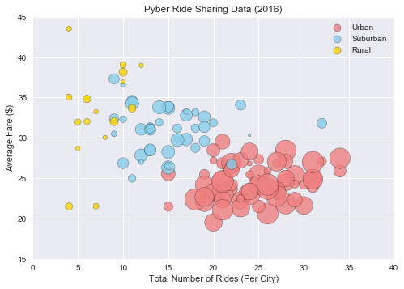
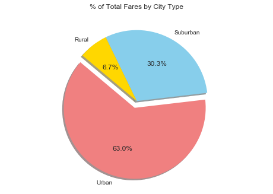
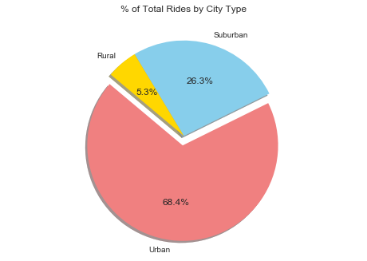
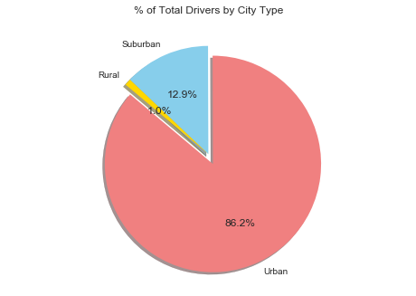

## Pyber Ride Sharing 
### Melvin Garcia


```python
# Import Dependencies
import os
import pandas as pd
import numpy as np
import seaborn as sns
import matplotlib.pyplot as plt
```


```python
# Read in files using pandas

csv_path_city = os.path.join('raw_data', 'city_data.csv')
csv_path_ride = os.path.join('raw_data', 'ride_data.csv')

city_df = pd.read_csv(csv_path_city)
ride_df = pd.read_csv(csv_path_ride)

# Drop duplicates
city_df = city_df.drop_duplicates('city', keep='first')

# Merge city and ride df on 'city' column
city_ride_df = ride_df.merge(city_df, on = 'city')
```


```python
# Peek at data
city_ride_df.head()
```


<div>
<style>
    .dataframe thead tr:only-child th {
        text-align: right;
    }

    .dataframe thead th {
        text-align: left;
    }

    .dataframe tbody tr th {
        vertical-align: top;
    }
</style>
<table border="1" class="dataframe">
  <thead>
    <tr style="text-align: right;">
      <th></th>
      <th>city</th>
      <th>date</th>
      <th>fare</th>
      <th>ride_id</th>
      <th>driver_count</th>
      <th>type</th>
    </tr>
  </thead>
  <tbody>
    <tr>
      <th>0</th>
      <td>Sarabury</td>
      <td>2016-01-16 13:49:27</td>
      <td>38.35</td>
      <td>5403689035038</td>
      <td>46</td>
      <td>Urban</td>
    </tr>
    <tr>
      <th>1</th>
      <td>Sarabury</td>
      <td>2016-07-23 07:42:44</td>
      <td>21.76</td>
      <td>7546681945283</td>
      <td>46</td>
      <td>Urban</td>
    </tr>
    <tr>
      <th>2</th>
      <td>Sarabury</td>
      <td>2016-04-02 04:32:25</td>
      <td>38.03</td>
      <td>4932495851866</td>
      <td>46</td>
      <td>Urban</td>
    </tr>
    <tr>
      <th>3</th>
      <td>Sarabury</td>
      <td>2016-06-23 05:03:41</td>
      <td>26.82</td>
      <td>6711035373406</td>
      <td>46</td>
      <td>Urban</td>
    </tr>
    <tr>
      <th>4</th>
      <td>Sarabury</td>
      <td>2016-09-30 12:48:34</td>
      <td>30.30</td>
      <td>6388737278232</td>
      <td>46</td>
      <td>Urban</td>
    </tr>
  </tbody>
</table>
</div>


```python
# Set variables for bubble plot

avg_fare_by_city = city_ride_df.groupby('city').mean()['fare']

ride_count_by_city =  city_ride_df.groupby('city')['ride_id'].count()

driver_count_by_city = city_ride_df.groupby('city').mean()['driver_count']

city_type = city_df.set_index('city')['type']

city_summary = pd.DataFrame({'Total Number of Rides':ride_count_by_city,
                            'Total Number of Drivers':driver_count_by_city,
                            'Average Fare ($) Per City':avg_fare_by_city,
                            'City Type':city_type})


```


```python
# Peek at city_summary

city_summary.head()
```


<div>
<style>
    .dataframe thead tr:only-child th {
        text-align: right;
    }

    .dataframe thead th {
        text-align: left;
    }

    .dataframe tbody tr th {
        vertical-align: top;
    }
</style>
<table border="1" class="dataframe">
  <thead>
    <tr style="text-align: right;">
      <th></th>
      <th>Average Fare ($) Per City</th>
      <th>City Type</th>
      <th>Total Number of Drivers</th>
      <th>Total Number of Rides</th>
    </tr>
  </thead>
  <tbody>
    <tr>
      <th>Alvarezhaven</th>
      <td>23.928710</td>
      <td>Urban</td>
      <td>21.0</td>
      <td>31</td>
    </tr>
    <tr>
      <th>Alyssaberg</th>
      <td>20.609615</td>
      <td>Urban</td>
      <td>67.0</td>
      <td>26</td>
    </tr>
    <tr>
      <th>Anitamouth</th>
      <td>37.315556</td>
      <td>Suburban</td>
      <td>16.0</td>
      <td>9</td>
    </tr>
    <tr>
      <th>Antoniomouth</th>
      <td>23.625000</td>
      <td>Urban</td>
      <td>21.0</td>
      <td>22</td>
    </tr>
    <tr>
      <th>Aprilchester</th>
      <td>21.981579</td>
      <td>Urban</td>
      <td>49.0</td>
      <td>19</td>
    </tr>
  </tbody>
</table>
</div>


```python
# Categorize by city type
urban_df = city_summary.loc[city_summary['City Type'] == 'Urban']
suburban_df = city_summary.loc[city_summary['City Type'] == 'Suburban']
rural_df = city_summary.loc[city_summary['City Type'] == 'Rural']

urban_df.head()
```


<div>
<style>
    .dataframe thead tr:only-child th {
        text-align: right;
    }

    .dataframe thead th {
        text-align: left;
    }

    .dataframe tbody tr th {
        vertical-align: top;
    }
</style>
<table border="1" class="dataframe">
  <thead>
    <tr style="text-align: right;">
      <th></th>
      <th>Average Fare ($) Per City</th>
      <th>City Type</th>
      <th>Total Number of Drivers</th>
      <th>Total Number of Rides</th>
    </tr>
  </thead>
  <tbody>
    <tr>
      <th>Alvarezhaven</th>
      <td>23.928710</td>
      <td>Urban</td>
      <td>21.0</td>
      <td>31</td>
    </tr>
    <tr>
      <th>Alyssaberg</th>
      <td>20.609615</td>
      <td>Urban</td>
      <td>67.0</td>
      <td>26</td>
    </tr>
    <tr>
      <th>Antoniomouth</th>
      <td>23.625000</td>
      <td>Urban</td>
      <td>21.0</td>
      <td>22</td>
    </tr>
    <tr>
      <th>Aprilchester</th>
      <td>21.981579</td>
      <td>Urban</td>
      <td>49.0</td>
      <td>19</td>
    </tr>
    <tr>
      <th>Arnoldview</th>
      <td>25.106452</td>
      <td>Urban</td>
      <td>41.0</td>
      <td>31</td>
    </tr>
  </tbody>
</table>
</div>


```python
# Assign colors per city type
colors = {'Urban': 'lightcoral', 'Suburban': 'skyblue', 'Rural': 'gold'}

city_colors = {'Urban': colors['Urban'], 'Suburban': colors['Suburban'], 'Rural': colors['Rural']}
```

## Bubble Plot of Ride Sharing Data


```python
# Create scatter plot for each city type

plt.scatter(urban_df['Total Number of Rides'], 
            urban_df['Average Fare ($) Per City'], s = urban_df['Total Number of Drivers']*10, 
            color = city_colors['Urban'], edgecolor = 'black', label = 'Urban', alpha = 0.8)

plt.scatter(suburban_df['Total Number of Rides'], 
            suburban_df['Average Fare ($) Per City'], 
            s = suburban_df['Total Number of Drivers']*10, 
            color = city_colors['Suburban'], edgecolor = 'black', label = 'Suburban', alpha = 0.8)

plt.scatter(rural_df['Total Number of Rides'], 
            rural_df['Average Fare ($) Per City'], s = rural_df['Total Number of Drivers']*10, 
            color = city_colors['Rural'], edgecolor = 'black', label = 'Rural', alpha = 0.8)

plt.xlabel('Total Number of Rides (Per City)')
plt.ylabel('Average Fare ($)')
plt.title('Pyber Ride Sharing Data (2016)')

plt.xlim([0, 40])
plt.ylim([15, 45])
plt.yticks(np.arange(15, 50, 5))
plt.xticks(np.arange(0, 45, 5))

lgnd = plt.legend()
lgnd.legendHandles[0]._sizes = [80]
lgnd.legendHandles[1]._sizes = [80]
lgnd.legendHandles[2]._sizes = [80]

plt.show()
```





## Total Fares by City Type


```python
type_fare_sum = city_ride_df.groupby('type')['fare'].sum().sort_values(ascending=False)

```


```python
list(type_fare_sum)
```


    [40078.339999999967, 19317.880000000008, 4255.090000000002]


```python
# Labels for the sections of our pie chart for all pie charts
labels = ['Urban', 'Suburban', 'Rural']

# The colors of each section of the pie chart for all pie charts
colors = ["lightcoral", "skyblue", "gold"]
```


```python
# Labels for the sections of our pie chart
labels = ['Urban', 'Suburban', 'Rural']

# The values of each section of the pie chart
type_vals = list(type_fare_sum)

# Tells matplotlib to separate the "Python" section
# from the others
explode = [0.1, 0, 0]

plt.axis("equal")
```


    (-0.055000000000000007,
     0.055000000000000007,
     -0.055000000000000007,
     0.055000000000000007)


```python
# Creates the pie chart based upon the values above

plt.pie(type_vals, labels=labels, colors=colors, explode=explode,
        autopct="{0:1.1f}%".format, shadow=True, startangle=140)

plt.title('% of Total Fares by City Type')

plt.show()
```





## Total Rides by City Type


```python
type_ride_count = city_ride_df.groupby('type')['ride_id'].count().sort_values(ascending=False)
```


```python
list(type_ride_count)
```


    [1625, 625, 125]


```python
# The values of each section of the pie chart
type_vals = list(type_ride_sum)

# Tells matplotlib to separate the "Python" section
# from the others
explode = [0.1, 0, 0]

plt.axis("equal")
```


    (-0.055000000000000007,
     0.055000000000000007,
     -0.055000000000000007,
     0.055000000000000007)


```python
# Creates the pie chart based upon the values above

plt.pie(type_vals, labels=labels, colors=colors, explode=explode,
        autopct="{0:1.1f}%".format, shadow=True, startangle=140)

plt.title('% of Total Rides by City Type')

plt.show()
```





## Total Drivers by City Type


```python
type_drivers_sum = city_ride_df.groupby('type')['driver_count'].sum().sort_values(ascending=False)

```


```python
list(type_drivers_sum)
```


    [64501, 9634, 727]


```python
# The values of each section of the pie chart
type_vals = list(type_drivers_sum)

# The colors of each section of the pie chart
colors = ["lightcoral", "skyblue", "gold"]

# Tells matplotlib to separate the "Python" section
# from the others
explode = [0.1, 0, 0]

plt.axis("equal")
```


    (-0.055000000000000007,
     0.055000000000000007,
     -0.055000000000000007,
     0.055000000000000007)


```python
# Creates the pie chart based upon the values above

plt.pie(type_vals, labels=labels, colors=colors, explode=explode,
        autopct="{0:1.1f}%".format, shadow=True, startangle=140)

plt.title('% of Total Drivers by City Type')

plt.show()
```





## Observable Trends

### - There appears to be somewhat of a negative trend with higher the total number of rides, the lower the average fare in dollars.

### - The average fare per ride is 10 dollars higher in rural areas than urban areas. This may be due to the average distance between destination points--points being farther in rural than urban areas.

### - Although labeled as part of a suburban area, the city of Port James' number of rides is comparable to the number of rides in the top 3 urban cities.
